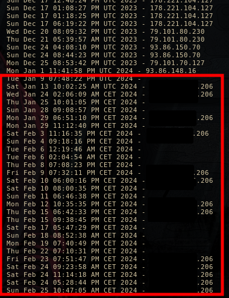

## IP Address Monitoring Script
This script is designed to monitor the public IP address of a system and log it at regular intervals. 
It's useful for tracking changes in the system's external IP address, which can be important for network administration and security purposes.

\
&nbsp;
## Usage
1. Ensure the script ippaddr.sh is placed in the /root directory.
2. Adjust the paths and timing in the cron job entries as needed.
3. The public IP address will be logged to data.log and to ipaddr.log at the specified intervals.

Note
- Make sure to grant execute permissions to ippaddr.sh (chmod +x ippaddr.sh) before running the cron jobs.
- Customize the script and cron jobs according to your system's setup and requirements.

\
&nbsp;
## Dependencies
This script relies on the following dependencies:
- curl - For fetching the public IP address.
- mtr - For performing a traceroute.

\
&nbsp;
## Cron Job Setup

To set up these cron jobs:
1. Open a terminal or SSH into your server.
2. Type `crontab -e` and press Enter to open the crontab file for editing.
3. Copy and paste the respective cron job entries into the file.
4. Save and close the file. (In most text editors, you can do this by pressing Ctrl + X, then Y, and finally Enter.)

Ensure that:
- The paths to your scripts (`/root/ippaddr.sh`) and log files (`/root/ipaddr.log`, `/root/data.log`) are correct.
- The script `ippaddr.sh` is executable (`chmod +x /root/ippaddr.sh`).

```bash
@reboot sleep 300 && /root/ippaddr.sh >> /root/data.log 
0 21 * * * sleep 300 && /root/ippaddr.sh >> /root/data.log 
0 0 * * * sleep 300 && /root/ippaddr.sh >> /root/data.log 
@reboot sleep 300 && (echo -n $(date); echo -n " - "; echo $(curl -s https://api.ipify.org/ )) >> /root/ipaddr.log 
```

\
&nbsp;
## Explanation
1. **Run the script after 300 seconds :** This cron job will execute the script `ippaddr.sh` after a delay of 300 seconds (5 minutes) when the system reboots, and append the output to a log file.
```bash
@reboot sleep 300 && /root/ippaddr.sh >> /root/data.log 
```
  
    
2. **Run the script at 21:00 and at 00:00 every day:** This cron job will execute the script `ippaddr.sh` every day and append the output to a log file.
```bash
0 21 * * * sleep 300 && /root/ippaddr.sh >> /root/data.log 
0 0 * * * sleep 300 && /root/ippaddr.sh >> /root/data.log 
```


3.  **Run the script after 300 seconds:** Then cron job will run `curl` to get public ip address and log it to `ipaddr.log`
```bash
@reboot sleep 300 && (echo -n $(date); echo -n " - "; echo $(curl -s https://api.ipify.org/ )) >> /root/ipaddr.log 
```

\
&nbsp;

## **Internet Service Providers**
- Most home internet service providers assign dynamic IP addresses to their customers, meaning the address changes every two to three days.
- This is common practice because providers charge extra for a static IP address, which would remain constant for a longer period. 
- This script enables monitoring of the IP address and detecting anomalies, such as static IP addresses that remain unchanged for an extended period.
- This way, users can track the stability of their internet connection and detect any changes that may indicate issues or unwanted activities on the network.


